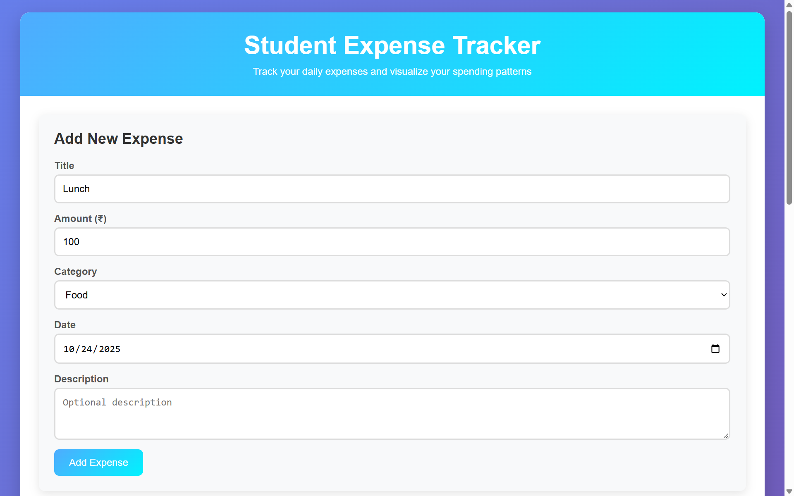
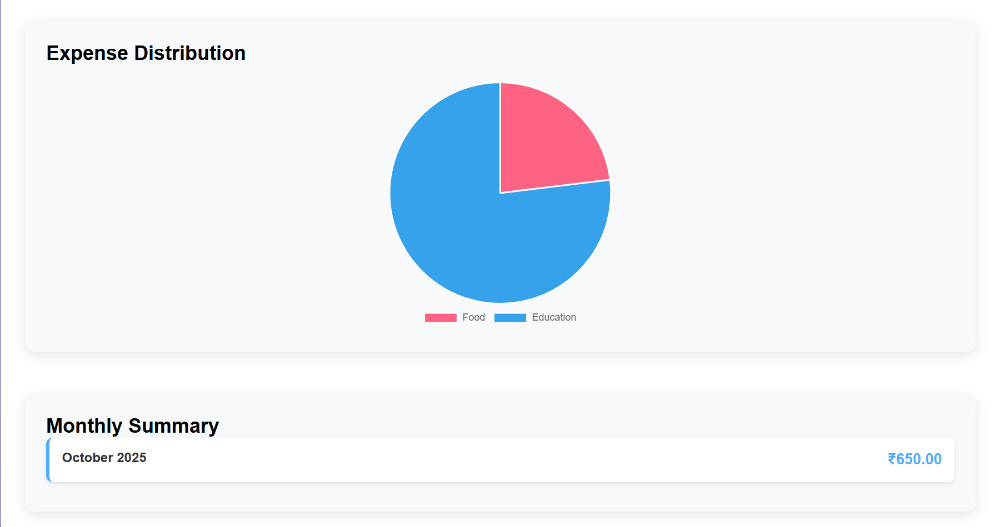
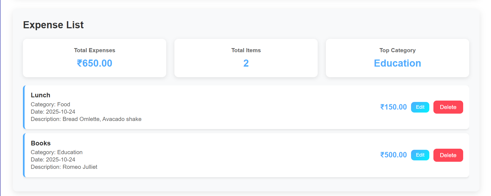

# Student-Expense-Tracker

A modern, responsive Single Page Application (SPA) built with React for tracking student expenses with interactive visualizations and comprehensive analytics.



## 🚀 Features

### Core Functionality
- ✅ **Add Expenses** - Create new expense entries with title, amount, category, date, and description
- ✅ **Edit Expenses** - Modify existing expense entries with real-time updates
- ✅ **Delete Expenses** - Remove unwanted expense entries
- ✅ **Expense Categories** - Organize expenses into Food, Transport, Education, Entertainment, Health, and Other
- ✅ **Real-time Analytics** - Automatic calculation of totals, counts, and top spending categories

### Advanced Features
- 📊 **Interactive Pie Chart** - Visual breakdown of expenses by category using Chart.js
- 📅 **Monthly Summary** - Track spending patterns across different months
- 💰 **Indian Currency Support** - All amounts displayed in Indian Rupees (₹)
- 📱 **Responsive Design** - Works seamlessly on desktop, tablet, and mobile devices
- 🔄 **Real-time Updates** - Instant UI updates without page refresh

## 🛠️ Technology Stack

### Frontend Technologies
- **React 18** - Modern JavaScript library for building user interfaces
- **ReactDOM** - React rendering library
- **Babel Standalone** - In-browser JSX transformation
- **Chart.js** - Interactive charts and data visualization
- **CSS3** - Modern styling with Grid, Flexbox, and animations

### Backend Simulation
- **Mock API Service** - In-memory data storage with async operations
- **JavaScript Promises** - Simulated network delays and responses

### Modern JavaScript Features
- **ES6+ Syntax** - Arrow functions, template literals, destructuring
- **Array Methods** - map(), filter(), reduce() for data manipulation
- **Async/Await** - Modern asynchronous programming
- **React Hooks** - useState, useEffect, useRef for state management

## 📊 Application Screenshots

### 1. Expense Form


*Comprehensive form with validation, Indian Rupee support, and description field*


### 2. Interactive Pie Chart


*Visual breakdown of expenses by category with percentages and tooltips*

### 3. Monthly Summary


*Track spending patterns across different months with detailed breakdown*


*Fully responsive design optimized for mobile devices*

## 📁 Project Structure

```
Student-Exp-Tracker/
├── index.html              # Main application file with embedded React components
├── styles.css              # Comprehensive styling and responsive design
├── README.md               # Project documentation
└── js/                     # Original component files (reference)
    ├── mockApi.js          # Mock backend API service
    ├── ExpenseForm.js      # Expense form component
    ├── ExpenseList.js      # Expense list and summary component
    ├── Chart.js            # Chart visualization component
    └── App.js              # Main application component
```

## 🚀 Getting Started

### Prerequisites
- Modern web browser (Chrome, Firefox, Safari, Edge)
- No additional installations required

### Installation & Setup
1. **Download** the project files
2. **Open** `index.html` in your web browser
3. **Start Adding Expenses** - The application loads with an empty expense list

### Usage Instructions

#### Adding Expenses
1. Fill in the expense form:
   - **Title** - Name of the expense
   - **Amount** - Cost in Indian Rupees (₹)
   - **Category** - Select from predefined categories
   - **Date** - When the expense occurred
   - **Description** - Optional additional details
2. Click **"Add Expense"** to save

#### Managing Expenses
- **Edit** - Click the "Edit" button on any expense item
- **Delete** - Click the "Delete" button to remove an expense
- **View Analytics** - Check the summary cards and charts for insights

## 🎯 Key Technical Features

### ES6+ JavaScript Implementation
```javascript
// Array methods for data processing
const total = expenses.reduce((sum, exp) => sum + exp.amount, 0);
const categoryData = expenses.reduce((acc, expense) => {
    acc[expense.category] = (acc[expense.category] || 0) + expense.amount;
    return acc;
}, {});

// Async/await for API operations
const handleAddExpense = async (expenseData) => {
    const newExpense = await mockApi.addExpense(expenseData);
    setExpenses(prev => [...prev, newExpense]);
};
```

### React Hooks Usage
```javascript
// State management with hooks
const [expenses, setExpenses] = useState([]);
const [editingExpense, setEditingExpense] = useState(null);

// Effect hook for data loading
useEffect(() => {
    mockApi.getAllExpenses().then(setExpenses);
}, []);
```

```
App (Main Container)
├── ExpenseForm (Add/Edit expenses with description)
├── ExpenseList (Display and manage expenses)
├── ExpenseChart (Pie chart visualization)
└── MonthlySummary (Monthly breakdown)
```

## 🎨 Design & User Experience

### Modern UI Features
- **Gradient Backgrounds** - Beautiful blue gradient theme
- **Card-based Layout** - Clean, organized information display
- **Interactive Elements** - Hover effects and smooth transitions
- **Color-coded Categories** - Visual distinction for different expense types

### Responsive Design
- **Desktop** - Full-width layout with optimal spacing
- **Tablet** - Adapted layout for medium screens
- **Mobile** - Single-column stack for mobile optimization

### Analytics Dashboard

- **Total Expenses** - Real-time sum calculation
- **Total Items** - Count of all expense entries
- **Top Category** - Highest spending category identification

## 🔧 Technical Implementation Details

### Data Flow Architecture
1. **User Input** → Form Component
2. **Form Submission** → Mock API Service
3. **API Response** → State Update
4. **State Change** → UI Re-render
5. **Analytics Update** → Charts and Summaries

### Mock API Service
```javascript
const mockApi = {
    expenses: [],
    async addExpense(expense) {
        const newExpense = { 
            ...expense, 
            id: Date.now() + Math.random(),
            amount: Number(expense.amount)
        };
        this.expenses.push(newExpense);
        return newExpense;
    }
};
```

### Chart.js Integration
```javascript
const chartInstance = new Chart(ctx, {
    type: 'pie',
    data: {
        labels: categoryLabels,
        datasets: [{
            data: categoryAmounts,
            backgroundColor: colors
        }]
    }
});
```

## 📈 Performance Features

### Optimization Techniques
- **React Virtual DOM** - Efficient re-rendering
- **In-memory Storage** - Fast data access
- **Minimal API Calls** - Reduced network overhead
- **Component Memoization** - Prevent unnecessary re-renders

### Browser Compatibility
- ✅ Chrome (recommended)
- ✅ Firefox
- ✅ Safari
- ✅ Edge
- ✅ All modern browsers with ES6 support

## 🌟 Educational Value

### Learning Outcomes
This project demonstrates:
- **Modern JavaScript** - ES6+ features and best practices
- **React Development** - Component-based architecture and hooks
- **Responsive Design** - Mobile-first CSS techniques
- **Data Visualization** - Interactive charts and analytics
- **State Management** - Centralized application state
- **API Integration** - Asynchronous data operations

### Code Quality Features
- **Clean Architecture** - Separation of concerns
- **Reusable Components** - Modular design approach
- **Error Handling** - Robust error management
- **Form Validation** - User input validation
- **Accessibility** - Screen reader friendly

## 🚀 Future Enhancements

### Planned Features
- **Real Backend Integration** - Node.js/Express API
- **Database Storage** - MongoDB/PostgreSQL integration
- **User Authentication** - Multi-user support
- **Export Functionality** - PDF/Excel reports
- **Budget Tracking** - Spending limits and alerts
- **Receipt Upload** - Image attachment support

### Technical Upgrades
- **Progressive Web App** - Offline functionality
- **Advanced Charts** - More visualization types
- **Testing Suite** - Unit and integration tests
- **Build Process** - Webpack/Vite optimization

## 👨💻 Development

### Local Development
1. Clone the repository
2. Open `index.html` in browser
3. Make changes and refresh to see updates
4. Use browser DevTools for debugging

### Contributing
1. Fork the project
2. Create feature branch
3. Make your changes
4. Test thoroughly
5. Submit pull request

## 📄 License

This project is open source and available under the MIT License.

---

## 🎓 Perfect for Learning

**Student Expense Tracker** showcases modern web development practices and is ideal for:
- Learning React fundamentals
- Understanding ES6+ JavaScript
- Practicing responsive design
- Building portfolio projects
- Demonstrating technical skills

